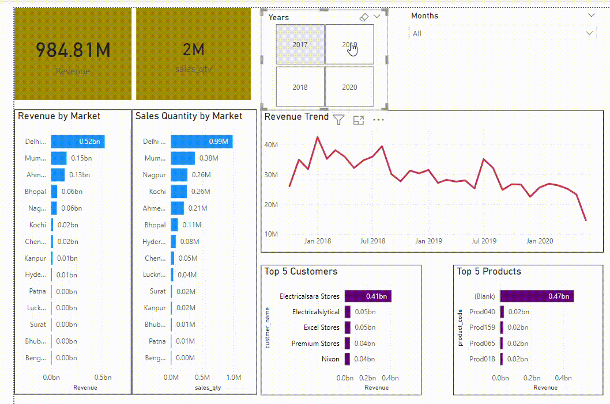

# Sales Insights Data Analysis for XYZ Company

## Overview
This project aims to provide a seamless solution for XYZ Company, which sells computer hardware and peripherals, to generate actionable sales insights. It empowers the Sales Director and other stakeholders with automated Power BI dashboards to identify areas of improvement, enabling data-driven decision-making.

## Problem Statement
- The Sales Director struggles to access regional sales insights quickly.
- Difficulty in identifying key areas of improvement and performance across regions.
- Manual data gathering processes are time-consuming and inefficient.

**Solution**: Create Power BI dashboards that provide a quick overview of sales performance, enabling easy access to insights.

## Project Planning
- **Project Management Approach**: AIMS Grid
- **AIMS Components**:
  - **Purpose**: Unlock sales insights previously unseen to support decision-making and automate them, reducing manual data gathering efforts.
  - **Stakeholders**: Sales Director, Marketing Team, Customer Service Team, Data & Analytics Team, IT.
  - **End Result**: Automated dashboards providing real-time sales insights to support informed decisions.
  - **Success Criteria**:
    - Dashboards uncovering sales order insights with up-to-date data.
    - 10% cost savings of total spent, driven by better decision-making.
    - Sales analysts save 20% of their time by eliminating manual data gathering.

## Data Pipeline & Analysis

### Step A: Data Discovery & Extraction
- **Data Source**: MySQL database (Sales Management System).
- **ETL Process**:
  - Transformation applied using Apache NiFi/Python Pandas.
  - Data is structured for analytics without impacting the MySQL OLTP (Online Transaction Processing System).
  - For simplicity, Power BI is directly connected to MySQL for analysis.

### Step B: Data Analysis
- **Tools**: SQL for data extraction and basic analysis.
- **Focus**: Identify sales trends, regional performance, and areas requiring improvement.

### Step C: Data Wrangling & Cleaning
- **Tools**: Power BI for ETL, data wrangling, and data transformation.
- **Schema**: STAR Schema with:
  - **Fact Table**: Transaction table containing sales data.
  - **Dimension Tables**: Region, Product, Time, and Customer dimensions for enriched analysis.

### Step D: Building Power BI Dashboard
- **Features**:
  - Interactive charts for regional sales performance.
  - Visualizations for key metrics such as sales growth, revenue by region, and product performance.
  - Filters to allow stakeholders to explore data across different time frames.

## Preview
  
*A GIF preview of the Power BI dashboard demonstrating key sales insights.*

## Results
- **Improved Decision-Making**: Real-time insights enabled the Sales Director to make data-driven decisions quickly.
- **Efficiency Gains**: Automated data insights saved 20% of the sales team's time, allowing them to focus on strategic activities.
- **Cost Savings**: Enhanced visibility into sales data resulted in a 10% reduction in total sales-related costs.

## Technologies Used
- **Database**: MySQL for data storage.
- **Data Transformation**: Apache NiFi, Python (Pandas).
- **Data Analysis & Visualization**: Power BI.
- **Schema Design**: STAR Schema for efficient data querying.

