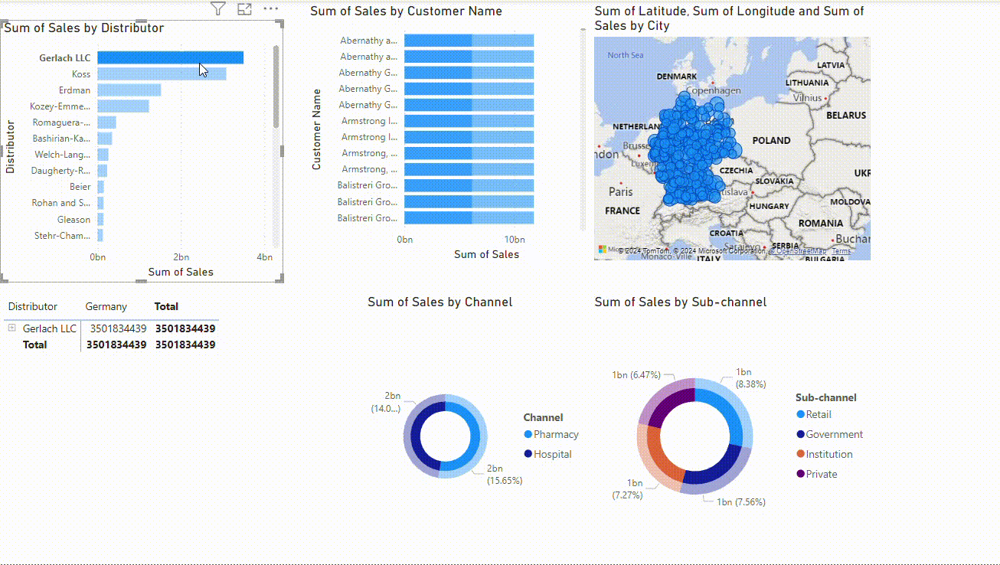
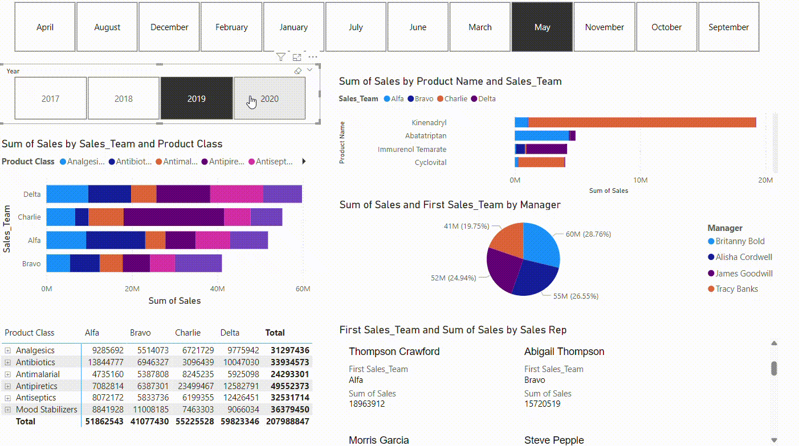
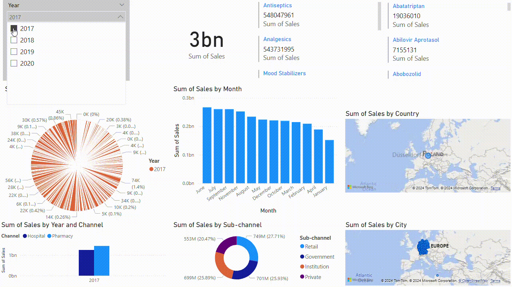

# Pharma Sales Data Analysis Project

## Overview
This project involves building a comprehensive Power BI data model for analyzing sales data of a pharmaceutical company. The goal is to create insightful reports and dashboards that empower stakeholders with data-driven decision-making capabilities.

## Key Objectives
1. **Schema Design**: Create a robust data model with appropriate tables and relationships.
2. **Relationships**: Establish connections between various tables like "Sales," "Customers," and "Distributors."
3. **Role-Playing Dimensions**: Implement role-playing dimensions for analysis.
4. **Row-Level Security**: Set up row-level security to restrict data access.
5. **DAX Calculations**: Use DAX for time-based analysis and ranking.

## Project Details

### 1. Schema Design
- **Data Model**: Designed a Power BI data model based on the provided Pharma dataset.
- **Key Tables**:
  - **Distributors**: Details of distributors.
  - **Customers**: Customer names, cities, and other information.
  - **Sales**: Records all sales transactions.
- **Schema Type**: Star Schema for optimized performance with a central Fact table (Sales) and Dimension tables (Customers, Distributors, Products).

### 2. Relationships
- Established relationships between tables:
  - Connected the **Sales** table to the **Customers** table using `Customer ID`.
  - Linked **Sales** with **Distributors** via `Distributor ID`.
- Enabled cross-filtering to support seamless navigation between related data points.

### 3. Role-Playing Dimensions
- Managed role-playing dimensions for:
  - **Sales Rep**: Represents individual sales representatives.
  - **Manager**: Represents sales managers overseeing sales activities.
- Created separate tables for each role and linked them back to the **Sales** table to support multiple perspectives.

### 4. Schema Optimization
- Built a **Star Schema** to ensure quick queries and optimal report performance.
- **Benefits**:
  - Reduced query complexity.
  - Improved loading times and performance for large datasets.

### 5. Row-Level Security (RLS)
- Set up RLS to restrict access for a specific sales team:
  - Created security roles based on `Region` or `Sales Rep ID`.
  - Measures like **Total Sales** and **Profit** are filtered based on user access.

### 6. Calculated Columns vs. Measures
- **Calculated Column**: Added a column to calculate `Total Sales` (`Quantity * Price`).
- **Measure**: Created a DAX measure for `Total Sales`.
- **Comparison**:
  - Calculated columns are evaluated during data refresh and stored in memory.
  - Measures are evaluated dynamically, allowing for greater flexibility in reporting.

### 7. Time Intelligence
- Created a **Year-to-Date (YTD) Sales** measure using DAX:
  ```DAX
  YTD Sales = CALCULATE(SUM(Sales[Sales Amount]), DATESYTD(Date[Date]))

**Technologies Used**
 - Technologies Used
 - Data Source: MySQL Database
 - ETL Tools: Power BI, DAX for data calculations
 - Schema Design: Star Schema with Fact and Dimension tables
 - Data Visualization: Power BI Dashboards with custom visuals

## Preview
### Distributor & Customer Analysis
 

### Sales Team Performance
 

### Executive Summary
 